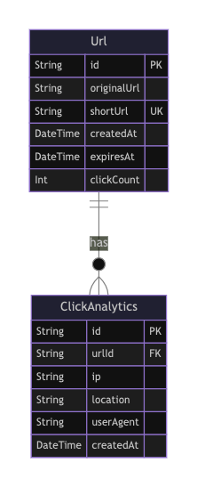

## Project Overview

The URL Shortener Service is a backend tool designed to shorten long URLs, provide easy redirection to the original URLs, and track usage analytics. It is perfect for marketing campaigns, social media sharing, and personalized URL branding. With this service, users can create custom short URLs, monitor engagement through click statistics, and set expiration dates for links.

## Features

- Short URL Generation: Automatically generate unique and shortened URLs from long links.
- Redirection: Users will be redirected to the original URL when clicking on the shortened URL.
- Click Analytics: Track detailed statistics including the location, browser, and device of the users who clicked the link.
- Customizable Expiration: Set an expiration date on the shortened URL, after which it will no longer work.
- User Management: Allow users to manage their own shortened URLs.

## Use Cases

- Marketing Campaigns: Track engagement with shortened links in campaigns. Get insights on how, where, and when the link is clicked.
- Social Media Sharing: Make long URLs shorter and more shareable on social platforms like Twitter and Instagram.
- Branding: Customize URLs to match branding strategies, making the links more memorable and on-brand.

And many more...

## Technologies Used

Backend: Node.js (Express)
Database: PostgreSQL

## ER Diagram



## API Documentation

- Swagger API Documentation is available at `/api-docs` route.

```bash
http://localhost:3000/api-docs
```

## Running Locally

> [!NOTE]  
> This project uses [pnpm](https://pnpm.io/) only as a package manager.

1. Clone the repository:

```bash
git clone https://github.com/Aryan75Way/url-shortener.git
```

2. Navigate to the project directory:

```bash
cd ./url-shortener
```

3. Create a .env.production file & Copy the below environment variables to `.env.development`.

```bash
PORT = 3000
NODE_ENV = "development"
```

4. Install dependencies:

```bash
pnpm install
```

5. Start the development server:

```bash
pnpm dev
```

6. Access the application in your browser:

```bash
http://localhost:3000
```
